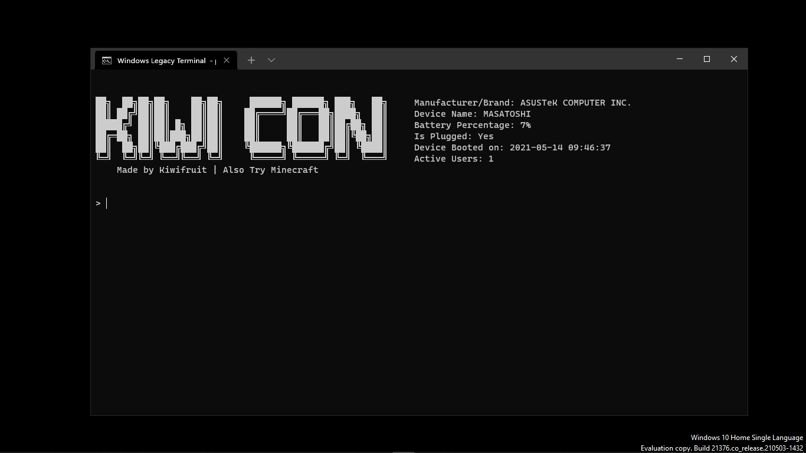
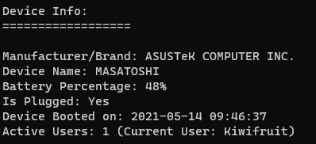
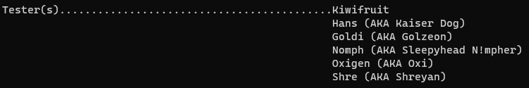
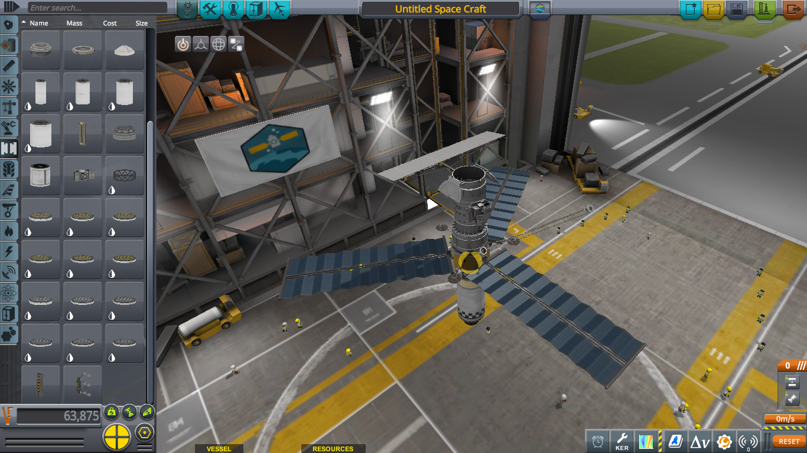

# KiwiCon
A console program (originally made in Batch) reworked because I am not advanced in Batch

# Hello there!
Hello. And welcome to this GitHub repo.

This time, instead of writing the software and then creating a repo, I will update the repo as I go along with this project.

In case you are wondering, the day I am writing this part is April 20, 2021, and this is day one

# Day One

Day one. Everything gotta start with something.

I started with creating the functions that I'll need. `morse.py` and `hash.py` for now.

Also, I just learned about `argparse` so yea

So this is the code for `morse.py`. I will make `hash.py` later:
```py
import argparse
from morse_code import encrypt, decrypt
parser = argparse.ArgumentParser(prog="morse.exe", description="Encode Plaintext to Morse and Vise Versa", epilog="Note that either \"-d\" or \"-e\" or their verbose counterparts MUST be present")
parser.add_argument("-d", "--decode", help="Decodes Text", action="store_false")
parser.add_argument("-e", "--encode", help="Encodes text", action="store_true")
parser.add_argument("text", help="Text to be Encoded/Decoded")
args = parser.parse_args()
encodeDecode = args.text
if args.encode:
    print(encrypt(encodeDecode))
else:
    print(decrypt(encodeDecode))
```
_You were expecting beautiful and organized Python Code, but it was me, Dirty, Programmer-style code_

So, if you know your stuff and understand what that code does, good, then cool.
For those people who don't, this is what it does:
```
>> Gets that little dude called "argparse"
>> Gets another little dude called "morse_code" and yes, it converts plaintext to morse. I am only doing this bc nostalgia
>> Make variable called "parser" and give it the fucking ArgumentParser thingy. This is the "root" of the program to which arguments (not the irl ones bc those are stupid as fuck) are made
>> [The three lines below it] basically mean that we take "parser, the ArgumentParser of the west" and load a couple arguments so our program has a purpose unlike us
>> Make variable "args" and parse "parser"
```
Now, I can hear your brain go _But Kiwi, why `if args.encode:`?_

Well, since we made this little boi called `args` earlier, yeah? Well Mr.`args` here is now the captain, so yea.
Basically, as far as a 13-year old's brain can handle, `args.encode` is there because:
a) I made it so that if `-e` or `--encode` is passed it passes a `True`, then it encode. Else, decode. `encodeDecode` is just for saif n stuff but hey, Python is [multi-paradigm](https://askinglot.com/what-is-meant-by-multi-paradigm)

And umm yea, I got school . So I gotta update the repo quick or me mom go kill kill.

Ight cya

Edit: I also forgot that I already have the source for the console, so yea

now **cya**

Edit Edit: Thank you to my buddy (not gonna name him ofc) for pointin a _minor_ flaw in this README.

_How many times do I have to "cya" before I can **actually** get out of here?_

# Day Two

Today's another day (at least for me lol)

So that means another day of Documentation/Journal thingy idk

So for today, I started learning Lua (LMAOOOO). I haven't changed the repo much.

But I am motivated so yea...I brought the `hash.py` file I talked about yesterday and decided: _More Doctor's Code, please_ so I did just that:
```py
import argparse
import hashlib
hasher = argparse.ArgumentParser(prog="hash.exe", description="Hashing Algorithms bundled into one file", )
hasher.add_argument("-t", "--type", type=int, help="Type of hashing algorithm you want to use")
hasher.add_argument("text", help="The text you want to encrypt/hash")

args = hasher.parse_args()
```
__Of course__ it's not yet done. I still got some of that keystrokes left, brb in a while...

Back! And I have a plan  thingy with this one:
```
0 = shake_128
1 = shake_256
2 = BLAKE2b (x64 OSs)
3 = BLAKE2s (x86 OSs)
4 = SHA-1
5 = SHA-256 (Parkour)
6 = SHA-512 (EXTRA Parkour)
7 = Base16
8 = Base32
9 = Base64
```
Yeah, that is some complex plan. Better start working on it...

Hello and I am back lol. This is genuinely the most scared I am getting (I think):
```py
if args.type == 0:
    msg = hashlib.shake_128(args.text).hexdigest()
if args.type == 1:
    msg = hashlib.shake_256(args.text).hexdigest()
if args.type == 2:
    msg = hashlib.blake2b(args.text).hexdigest()
if args.type == 3:
    msg = hashlib.blake2s(args.text).hexdigest()
if args.type == 4:
    msg = hashlib.sha1(args.text).hexdigest()
if args.type == 5:
    msg = hashlib.sha256(args.text).hexdigest()
if args.type == 6:
    msg = hashlib.sha512(args.text).hexdigest()
if args.type == 7:
    msg = base64.b16encode(args.text)
if args.type == 8:
    msg = base64.b32encode(args.text)
if args.type == 9:
    msg = base64.b64encode(args.text)
print(msg)
```

All I know what this does is that for `hashlib`, I hash using hash algorithm, then digest it???? I dunno

For `Base64`, All I know is only recieved from [the module's documentation](https://docs.python.org/3/library/base64.html).

Also, forgot to say at this point but I'm using VSCode from the start of the `Day Two` header. And that's because I got [GitHub for Desktop](https://desktop.github.com)

Anyways, I got that luchies to take, so cya later in the afternoon when I got the time I guess

# Day Three

This will probably come out very, *very* late, since I am grounded from internet access for a while. Such unpoggers, I know.

Anyways, today I plan to start on the actual migration part. I also changed a small bit about the headers. Hope you don't notice lmaoo

`hash.py` doesn't work so yeah, also gotta fix that...

Starting with the migration thingy since I cannot fix `hash.py` as I am right now

Please do note that it takes a long time for me to do that...

# Day Four
Today, we shall create a very important command, the `shell` command.

Basically, this would handle the interaction between the program and `cmd.exe`, which is the Command prompt.

You remember this from day 1?
> I started with creating the functions that I'll need. `morse.py` and `hash.py` for now.

Yeah, we're gonna double down on that and just yeet that out of the project. I will make everything you can do with this program in one file because yee. SCRIPTING I GO

# Day Five
This took WAY too long for me to update this README, since I forgot that this file existed

Also I left the `shell` command's code unfinished so I finished it 🎉🎉🎉

And the problems with some commands like `fixTaskbar` and `info` are fixed (you probably never saw it but okay. Also these bad bois are dead just to inform you)

Also did some uniforming on the documentation for the commands (for using the `help <command>` command) and some easter eggs. Hope you find them

Yeah, today is May 15, 2021. Or as of me typing this it _is_ May 15. If you didn't notice, I changed the gears of this program from manual to automatic by turning it from manually looping a variable that requests input and putting if statements like a snake's den to using the `cmd` module

This made my life a ton easier on this project.
Instead of doing if statements, I just prefix the function with `do_` ~~then add `self` into one of the params~~ <u>`self` was optional, I was stupid. And yes, this took me 12 days to update this part</u>, followed by the params that the function needs

And the module even supports CUSTOMIZATION. You know this is very poggers in my eyes

Just check this out:
```py
    prompt = "> "
    intro = banner # This one is a variable with the KiwiCon logo
    doc_header = "Available Commands"
    undoc_header = "Experimental or Underdeveloped commands"
```

Then this is the output:


It figured out everything for me so I can focus on implementing commands. That is very neat

I also added a small piece of code that gets the name of the user and displays it. 4th wall breaking unless your account name is Kiwifruit lmao



I named my pc Masotoshi because I drank some LEMMINO juice. Shut up

Its quite weird how my first four days were no screenshot then in day five yes screenshot.

Well I am sleepy, and the `morse` function is bugged like cray. It just spits a memory adress. Gonna need some help on that

Anyways, I got the morsecode and hash to code. The hash can probably wait...

Finally, I made a small team of testers to test my program. I will
have to clump them in a Discord server so that I can cooperate with them

Here are the testers:
- Hans (AKA Kaiser Dog)
- Goldi (AKA Golzeon)
- Nomph (AKA Sleepyhead N!mpher)
- Oxigen (AKA Oxi)
- Shre (AKA Shreyan)

Well that is not the full list. I might add or **_d e l e t_** a dude or two lmao

And _of course_ I have to add the nicknames and funny names in the program



Please don't call oxi "Oxigen" pls. [ENTER PRONOUN HERE] might kill me for that

# Day Six
Yeah, since I am still grounded, I will have to prepare with the testers team and the releases. I have an idea on what to do (You seeing this means that I am back online)

Basically, I make a webhook in a server that I made <u>**specifically**</u> for the testers. When I update the GitHub repo's `releases` tab, I will use the webhook to send a message. Basically announcing. Of course, this program is designed specifically for the webhook, so it might take a while but with the amout of time I have in my hands while disconnected, I can pull it off.

For days 6 and 7 I am gonna focus on that, not much on the development of the console so I might not add a day here for a while...

# Day Eight
Today, I removed a couple things that don't work just to make the code more cleaner (bye bye, `info` command. Nobody was able to use you, but you are too big to stay here so move your sad ass out of my program).

Yeah...I have no idea why I did not document much here ( ͡• ͜ʖ ͡• )

# Day Nine
Yeah, it may seem like I have been doing this everyday, but no. I have barely any motivation to continue this project because......***R O C K E T***

Yeah, I have been playing a lot of KSP lately, I even setup a couple relays to minmus and the mun. Here are some images to distract you from my slowly-dwindling motivation


Beutiful shot of Kerbin (Home Planet | IRLC: Earth) and Kerbol (IRLC: Sun)


First manned mission to the Mun (IRLC: Moon). This tooke me a long while because I did the fancy route of probes first, then people. This was my first modded gameplay, as you can see Kerbal Engineer on the left because they can't fit properly in the top as you can see here. Yes, I called the landing site the Sea of Noice because it was noice (lol)

 <!-- Get it? Dwayne? "The Rock" is his nickname -->

I had a selfie with Dwayne Johnson. Who knew that he'd be here on the mun...



Prometheus II. The first one failed because the modded parts' "ratings" (their recommended altitude) were too far apart and the probe cannot produce a proper image. Best image on that mission was too small to make use of, So I separated the instruments, giving it three different probes. This one here is for mapping the visual attribute thingys of Minmus (o yea, this thing's for minmus). I also had to become very creative for this one because `interstage nodes` (Fairing option that allows multiple payloads) only allowed two payloads of the length that my probes are at (as you can see, this kinda looks overkill, but I put fuel on all my probes and relays just in case I need a small change, which I will since this mod is pretty demanding when it comes to orbit)

You know what? Viewing the whole document told me that the past me was very stupid and very ambitious and probably very arrogant when I started this project.

Well, I got a couple of people I wish to be onboard on this project to help me out because let's face it, this is gonna be my summer project. And I need a lot of help as a noob programmer. Let's just hope they accept my favor and all goes very well

# Final Notes
Thanks a ton for reading this, even though its kinda boring...and long...and suuuuuuuuuuuuuuuuuuuuuuper boring. idk who you are but thanks

If you see my code and you think you can fix it, please do. I have been coding for around 5 months now (Late December to mid-May) so I don't have much experience with python and its cmd module

If you do that, thanks a ton in advance. But if you're here to just check this program out, thanks in advance too

If you wanna get the program, you can head to the `Releases` tab right around the `Files` tab and select the version you prefer (I prefer the latest version lol)

Again, thanks a ton for just going to this repo, reading the README (hopefully) and just looking around. I hope you had a great time here.

This has been Kiwifruit (misspelled my username lol) and have a nice day


Oh yeah, I think it's time to update my website somehow. It has been _waaaaaaaaaaaaaaaaaay_ too long since I last updated it. Look forward to it [here](https://e3.mahkiwi123.repl.co)
